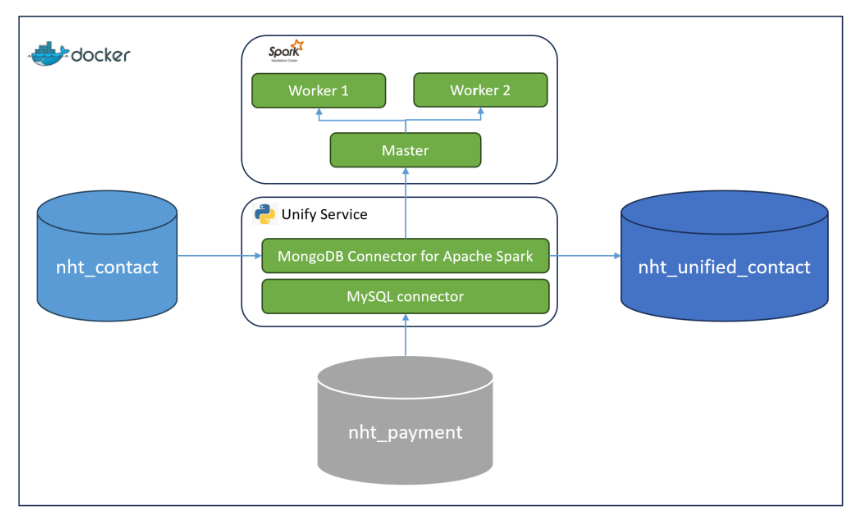

# Introduction

This project is about demonstrating how to implement data unification using Spark. This project simulates a \
Customer Data Platform with three databases:

- **nht_contact**: a MongoDB database contains two collections:

  - contact: store customer information including firstName, lastName, email, phone, gender,...

  - contact_activity: score customer activities (click an email, access a website, send a message,...)

- **nht_payment**: a MySQL database contains two tables

  - product: store product data

  - transaction: store transactions between customers and products.
- **nht_unified_contact**: a MongoDB database to store unified contact

The requirement of this project is to implement a **"unify service"** which creates a single customer 360-degree view 
unified from the above **nht_contact** and **nht_payment** data sources. This service requires a **"primary_key"** parameter 
which is a set of fields in nht_contact.contact collection to identify which customer attributes will be used to match the data, when merging the data the latest data will be prioritized.



We also create sample data to demonstrate the unification including:

- nht_contact.contact: 100 documents
- nht_contact.contact_acitivy: 1000 documents
- nht_payment.product: 18 records
- nht_payment.transaction: 1000 transactions

## Tech stack

Docker Compose, Spark 3.3.0, Python 3.8, PySpark, MySQL, MongoDB, JDK 11

## Project structure
    .
    ├── docker                    
    ├──── init_mongo_contact                    # contain initial script to create sample data for nht_contact database
    ├──── init_mongo_unify                      # contain initial script to create unified_contact collection for nht_unified_contact database
    ├──── init_mysql_payment                    # contain initial script to create sample data for nht_payment database
    ├──── docker-compose.yml                    # build up the entire system
    ├── app.py                                  # implement unify_service           
    ├── requirements.txt                        # dependencies management          
    └── Dockerfile                              # containerize unify_service into Docker image

## How to get started?
We need to containerize unify_service into Docker image before using docker-compose:
```shell
cd docker
docker build -t unify-service .
docker-compose up
```
A sample data unification process will be triggered after starting unify-service container with primary_key is **[email, first_name]**. You can access
to the **nht_unified_contact** to observer the newly created unified contacts.
